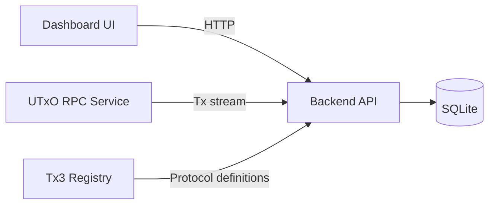
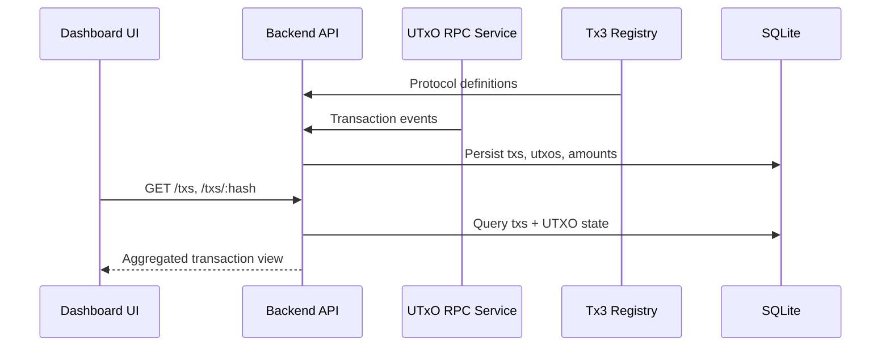
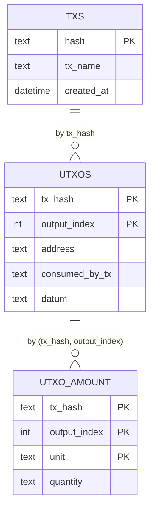

# tx3 Dashboard

This project provides a backend service that ingests Cardano transactions via the utxorpc service and exposes a read API for a web dashboard. 
The dashboard consumes the backend API to present transaction activity, UTxOs, and asset movements in a structured, queryable view.

## How it works

1. **Load protocol**: The backend fetches protocol definitions and parameters from the tx3 registry.
2. **Ingest transactions**: utxorpc streams new transactions to the backend.
3. **Persist state**: The backend normalizes transaction data into SQLite tables.
4. **Serve the dashboard**: The dashboard queries the API for aggregated transaction and UTxO views.

## Project structure (conceptual)

```
dashboard/
├── backend/      # API + ingestion service
└── frontend/     # Frontend UI (conceptual, not in repo yet)
```

## Architecture at a glance

- **Frontend dashboard**: Browser UI that queries the backend API.
- **Backend API**: Axum-based service that serves transaction data and aggregates UTxO state.
- **UTxO RPC ingestion**: Real-time transaction stream feeding the backend.
- **Tx3 Registry integration**: Fetches protocol definitions and parameters.
- **SQLite data store**: Persists transactions, UTXOs, and asset amounts.

## System context



## Data flow



## Data model



## API surface

### `GET /txs`

Returns a list of recent transactions ordered by `created_at` (newest first). Each item includes the protocol transaction name, inputs, outputs, and asset amounts.

Example response:

```json
[
  {
    "hash": "d03abcb194238e97b78fde2ad23965150fdf72b156731759b60f7d493836adbc",
    "tx_name": "buy_ticket",
    "inputs": [
      {
        "address": "addr1wy8ccvgzslpjf9yhrprvmqulpmjpkpxf8c0hvtjwvw8n6pqdcrnp0",
        "tx_hash": "31596ecbdcf102c8e5c17e75c65cf9780996285879d18903f035964f3a7499a8",
        "output_index": 0,
        "amount": [
          { "unit": "lovelace", "quantity": "12507620" }
        ],
        "datum": null,
        "consumed_by_tx": "d03abcb194238e97b78fde2ad23965150fdf72b156731759b60f7d493836adbc"
      }
    ],
    "outputs": [
      {
        "address": "addr1wywecz65rtwrqrqemhrtn7mrczl7x2c4pqc9hfjmsa3dc7cr5pvqw",
        "tx_hash": "d03abcb194238e97b78fde2ad23965150fdf72b156731759b60f7d493836adbc",
        "output_index": 1,
        "amount": [
          { "unit": "lovelace", "quantity": "1124910" },
          { "unit": "e1ddde8138579e255482791d9fba0778cb1f5c7b435be7b3e42069de425549444c45524645535432303236", "quantity": "1" }
        ],
        "datum": "d87981184b",
        "consumed_by_tx": null
      }
    ]
  }
]
```

### `GET /txs/:hash`

Returns a single transaction in the same expanded shape as `/txs`.

Example response:

```json
{
  "hash": "d03abcb194238e97b78fde2ad23965150fdf72b156731759b60f7d493836adbc",
  "tx_name": "buy_ticket",
  "inputs": [
    {
      "address": "addr1wy8ccvgzslpjf9yhrprvmqulpmjpkpxf8c0hvtjwvw8n6pqdcrnp0",
      "tx_hash": "31596ecbdcf102c8e5c17e75c65cf9780996285879d18903f035964f3a7499a8",
      "output_index": 0,
      "amount": [
        { "unit": "lovelace", "quantity": "12507620" }
      ],
      "datum": null,
      "consumed_by_tx": "d03abcb194238e97b78fde2ad23965150fdf72b156731759b60f7d493836adbc"
    }
  ],
  "outputs": [
    {
      "address": "addr1wywecz65rtwrqrqemhrtn7mrczl7x2c4pqc9hfjmsa3dc7cr5pvqw",
      "tx_hash": "d03abcb194238e97b78fde2ad23965150fdf72b156731759b60f7d493836adbc",
      "output_index": 1,
      "amount": [
        { "unit": "lovelace", "quantity": "1124910" },
        { "unit": "e1ddde8138579e255482791d9fba0778cb1f5c7b435be7b3e42069de425549444c45524645535432303236", "quantity": "1" }
      ],
      "datum": "d87981184b",
      "consumed_by_tx": null
    }
  ]
}
```

## Runtime configuration

The backend uses environment variables for configuration (server address, database path, registry URL, and utxorpc connection details). The frontend dashboard only requires the backend base URL to query the API.

## Component responsibilities

- **Backend API**: Aggregates transaction data and exposes `/txs` endpoints.
- **UTxO RPC ingestion**: Streams new transactions into the backend.
- **Registry integration**: Supplies protocol definitions and parameters.
- **Dashboard UI**: Presents transaction activity and UTXO state to users.

## Main concepts

- **Transaction**: Identified by `hash` and labeled by `tx_name`.
- **UTxO**: A specific output index associated with a transaction hash.
- **Asset amount**: Unit/quantity pairs attached to a UTXO.
- **Protocol tx name**: The protocol-level transaction identifier used for grouping.
