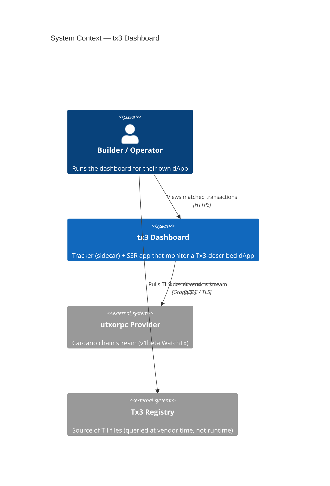

# tx3 Dashboard

A monitoring dashboard for [Tx3](https://github.com/tx3-lang)-described dApps. Builders and operators run it alongside `tx3-lift`'s tracker to see their protocol's matched on-chain transactions in real time, with parties and transaction names lifted from the TII. The dashboard is a pure TypeScript app (TanStack Start + Nitro SSR) that observes the SQLite file the tracker writes — no custom backend, no API tier in the middle.

## System context


```mermaid
C4Context
title System Context — tx3 Dashboard

Person(operator, "Builder / Operator", "Runs the dashboard for their own dApp")
System(dashboard, "tx3 Dashboard", "Tracker (sidecar) + SSR app that monitor a Tx3-described dApp")
System_Ext(utxorpc, "utxorpc Provider", "Cardano chain stream (v1beta WatchTx)")
System_Ext(registry, "Tx3 Registry", "Source of TII files (queried at vendor time, not runtime)")

Rel(operator, dashboard, "Views matched transactions", "HTTPS")
Rel(dashboard, utxorpc, "Subscribes to tx stream", "gRPC / TLS")
Rel(operator, registry, "Pulls TII once at vendor time", "GraphQL")
```

## Quick start

You need a clone of [`tx3-lang/tx3-lift`](https://github.com/tx3-lang/tx3-lift) as a sibling directory and a Demeter `utxorpc` API key.

```bash
# Once: clone tx3-lift sibling
git clone https://github.com/tx3-lang/tx3-lift ../tx3-lift
```

```bash
# Terminal A — tracker (sidecar that writes tracker.db)
cd ../tx3-lift
DMTR_API_KEY=dmtr_... cargo run -p tracker -- ../dashboard/tracker.toml
```

```bash
# Terminal B — dashboard (TanStack Start SSR app)
cd dashboard/frontend
pnpm install
pnpm dev
```

Open <http://localhost:3000>. See [`docs/running.md`](docs/running.md) for prerequisites, env vars, and troubleshooting.

## What the demo shows

The committed configuration tracks the [`buidler-fest/ticketing-2026`](protocols/buidler-fest/ticketing-2026.tii) protocol on Cardano preview. It defines a single transaction name (`buy_ticket`) with three parties (`buyer`, `treasury`, `issuer`) and roughly 80 real on-chain matches. The matches list at `/` shows every `buy_ticket` the tracker has seen, newest first; clicking through to `/txs/<hash>` shows the parties and their addresses for that transaction.

## Documentation

- [`docs/architecture.md`](docs/architecture.md) — two-process topology, data flow per page load, why the shape, Postgres outlook.
- [`docs/access-patterns.md`](docs/access-patterns.md) — AP-1 (list) and AP-2 (detail), with type signatures and SQL.
- [`docs/running.md`](docs/running.md) — prerequisites, env vars, first run, troubleshooting, deployment notes.

## Project structure

```
dashboard/
├── README.md                     # this file
├── tracker.toml                  # config consumed by the external tracker
├── docs/
│   ├── architecture.md
│   ├── access-patterns.md
│   └── running.md
├── protocols/
│   └── buidler-fest/
│       └── ticketing-2026.tii    # vendored TII for the demo protocol
└── frontend/                     # TanStack Start SSR app
    ├── package.json
    └── src/
        ├── lib/                  # db.ts, queries.ts, lifted.ts
        ├── components/           # PartyChip, TxNamePill, Header, ...
        └── routes/               # / (matches list), /txs/$hash (detail)
```
