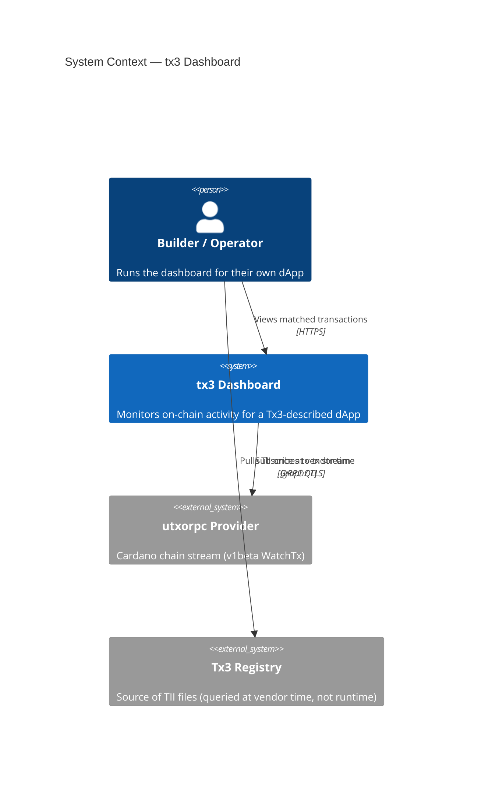
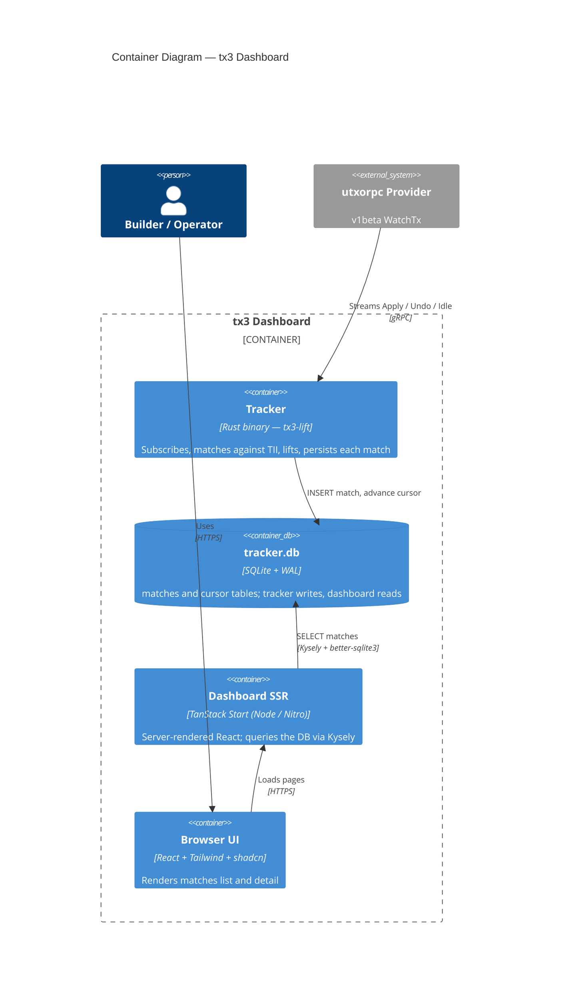
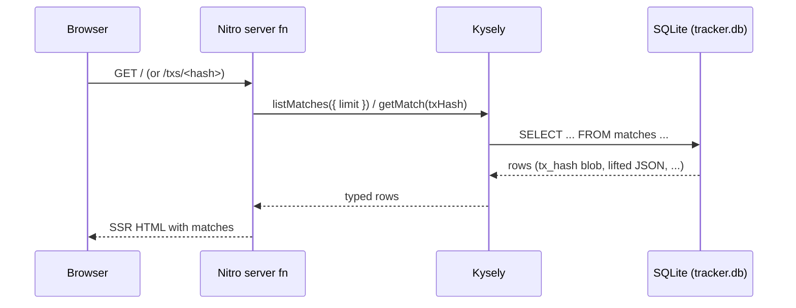

# Architecture

The tx3 Dashboard is a pure TypeScript application that observes the output of an external `tx3-lift` tracker. The tracker subscribes to a Cardano `utxorpc` stream, matches incoming transactions against a TII, and writes one row per match into a local SQLite file. The dashboard reads that same file via Kysely + better-sqlite3 from inside Nitro server functions and renders matches in the browser.

## System context (C4 L1)

## Containers (C4 L2)

The tracker and the dashboard are **decoupled at the SQLite file**. WAL mode (enabled by the tracker on first connect) lets the dashboard's reader run concurrently with the tracker's writer without blocking.

## Data flow per page load

The same Kysely instance is reused across requests in a process; better-sqlite3 opens the file in read-only mode and the dashboard never writes.

## Component responsibilities

- **Tracker** (Rust binary from [`tx3-lang/tx3-lift`](https://github.com/tx3-lang/tx3-lift), run as a sidecar): subscribes to the configured `utxorpc` stream, applies the `Fingerprint → Match → Lift` pipeline against the TII, and inserts one row into `matches` for each match. Owns the schema and the cursor.
- **Dashboard SSR** (this repo, `frontend/`): a TanStack Start app that opens `tracker.db` read-only inside Nitro server functions. `lib/db.ts` builds a Kysely instance, `lib/queries.ts` exposes `listMatches` and `getMatch`, `lib/lifted.ts` parses the small subset of the `lifted` JSON the MVP needs (parties + addresses).
- **SQLite (`tracker.db`)**: the integration boundary. WAL mode allows the writer (tracker) and the reader (dashboard) to run concurrently. The dashboard does not modify the schema, does not run migrations, and does not write rows.

## Why this shape

- **Single-purpose components.** The tracker is already battle-tested in `tx3-lift`. Embedding it as a library would re-litigate that. Running it as a sidecar lets it evolve in its own repo without ABI coupling.
- **Honest authority.** The tracker owns the schema; the dashboard observes. There is no risk of two implementations of the same schema drifting.
- **TanStack SSR is enough.** Nitro server functions can open SQLite directly. There is no use case in the MVP that needs a separate API tier, so we don't add one.
- **Trivial deployment.** Two processes — one is `cargo run`, the other is `pnpm build && node`. Operators can use tmux, systemd, pm2, or whatever else they prefer.

## Forward-looking: Postgres

The schema and access patterns are Postgres-portable. A future migration is split between the upstream tracker (1–3 days of upstream PR work to add a Postgres storage backend or replication path) and this repo (~half a day to swap `kysely`'s `SqliteDialect` for `PostgresDialect`, swap `better-sqlite3` for `pg`, and adjust the JSON path syntax in any `sql<T>` template literals — a single helper module).

See [§4.3 of the M3 design spec](superpowers/specs/2026-05-07-m3-dashboard-design.md#43-postgres-migration-plan-forward-looking-not-implemented) for the migration plan.
