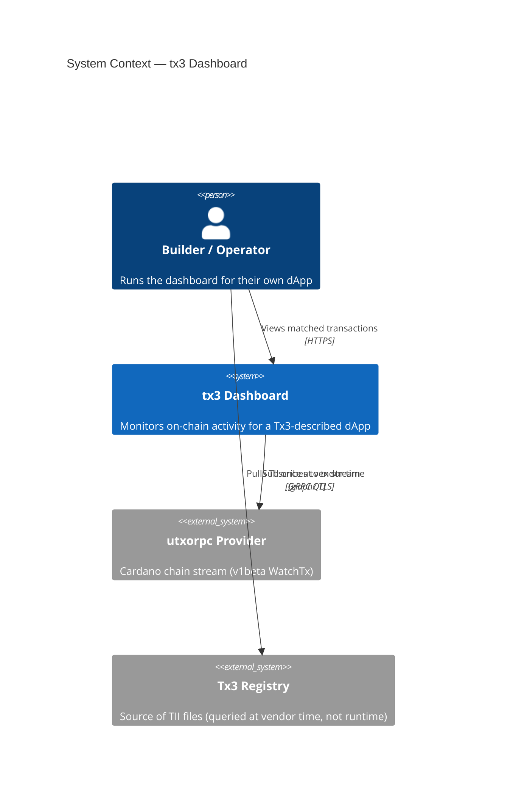
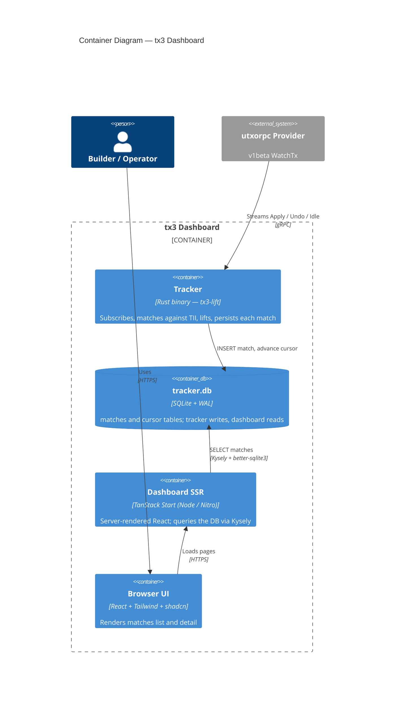

# Milestone 3 — Dashboard design spec (v2)

- **Date**: 2026-05-07
- **Milestone**: M3 (Dashboard)
- **Status**: design approved, plan pending

---

## 1. Context

### 1.1 What we have

- **M1** (this repo): public scaffolds for backend (Rust + Axum) and frontend (TanStack Start), CI workflows, an initial architecture document.
- **M2** (sibling repo `tx3-lang/tx3-lift`): chain-tracking engine `bin/tracker`, lift libraries (`crates/tx3-lift`, `crates/tx3-lift-cardano`), an `orcfax-burn` example, and an end-to-end integration test verified against mainnet. The tracker writes one row per matched transaction into a local SQLite, with the lifted record stored as JSON.

### 1.2 Acceptance criteria for M3 (Catalyst)

| ID | Requirement |
|----|-------------|
| A1 | Users can run and explore the web-based frontend |
| B1 | Users can access accurate data for each access pattern defined in the design |
| C1 | The example dashboard displays real on-chain data for the selected dApp protocol |
| D1 | Documentation on how to run the dashboard is publicly available |

### 1.3 Audience

- **Primary**: dApp builders / operators running the dashboard for their own dApp.
- **Secondary**: protocol developers in debug mode looking at decoded inputs/outputs.

This matches the proposal's framing: a low-effort monitoring solution for builders, not an explorer for end-users.

---

## 2. Pivot from v1

Two changes drive this revision:

1. **Tracker runs as an external process, not embedded.** The dashboard no longer compiles `tx3-lift` as a library. Operators run `tx3-lang/tx3-lift`'s `tracker` binary as a sidecar; the dashboard reads the SQLite file the tracker writes.
2. **No custom Rust backend.** The frontend (TanStack Start) reads SQLite directly via Nitro server functions. There's no Axum API layer in the middle. This eliminates an entire codebase from the M3 deliverable.

Result: the dashboard is a pure TypeScript application that observes the tracker's output. The tracker's authority over the data shape is preserved.

### 2.1 MVP scope (this revision)

The MVP is intentionally narrow:

- **List view**: every matched transaction, ordered most-recent-first, showing `tx_name` and the parties involved.
- **Detail view**: per-transaction page showing `tx_name` and the parties (named, with their address).

Everything else (overview metrics, accounts explorer, script log, anomaly detection, asset volume) is **deferred** to subsequent iterations. The M3 acceptance criteria are met by these two views plus the documentation requirement.

---

## 3. Architecture

### 3.1 Topology

#### System context (C4 L1)



#### Containers (C4 L2)



Two processes:
- **Tracker** (Rust, from `tx3-lang/tx3-lift`): consumes utxorpc, writes matches.
- **Dashboard** (TypeScript, this repo): SSR app that reads the SQLite file the tracker is writing.

They are decoupled at the SQLite file. WAL mode (already enabled by the tracker) lets the dashboard's reader run concurrently with the tracker's writer.

### 3.2 Why this shape

- **Single-purpose components.** The tracker is already battle-tested in tx3-lift; embedding it as a library would re-litigate that. Running it as a sidecar lets it evolve in its own repo without ABI coupling.
- **Honest authority.** The tracker owns the schema; the dashboard observes. No risk of drift between two implementations of the same schema.
- **TanStack SSR is enough.** Nitro server functions can open SQLite directly — there's no use case in the MVP that needs a separate API tier.
- **Trivial deployment.** Two processes; one is `cargo run`, the other is `pnpm build && node`.

### 3.3 What gets deleted from the M1 scaffold

- `backend/` — entire directory removed. The M1 backend was a placeholder; the v2 architecture doesn't have a Rust component on the dashboard side.
- `.github/workflows/backend-ci.yml` — removed.

### 3.4 What stays from the M1 scaffold

- `frontend/` — the TanStack Start scaffold is the foundation we build on. Stack stays: TanStack Router + TanStack Query + Tailwind 4 + shadcn + Biome + pnpm.
- `.github/workflows/frontend-ci.yml` — kept and used.

---

## 4. Data model

### 4.1 The tracker's schema (we observe it)

Authoritative definition lives in `tx3-lang/tx3-lift/bin/tracker/migrations/001_initial.sql`. Summary:

```sql
CREATE TABLE matches (
    id            INTEGER PRIMARY KEY,
    tx_hash       BLOB    NOT NULL,
    block_slot    INTEGER NOT NULL,
    block_hash    BLOB    NOT NULL,
    source_name   TEXT    NOT NULL,
    protocol_name TEXT    NOT NULL,
    tx_name       TEXT    NOT NULL,
    profile_name  TEXT    NOT NULL,
    lifted        TEXT    NOT NULL,        -- JSON-serialized Lifted record
    matched_at    INTEGER NOT NULL,        -- unix seconds
    UNIQUE(tx_hash, source_name)
);
CREATE INDEX idx_matches_block  ON matches(block_slot, block_hash);
CREATE INDEX idx_matches_source ON matches(source_name);

CREATE TABLE cursor (
    id          INTEGER PRIMARY KEY CHECK (id = 1),
    slot        INTEGER NOT NULL,
    block_hash  BLOB    NOT NULL
);
```

The dashboard does not modify the schema, does not run migrations, does not write rows.

### 4.2 The shape of `lifted` we depend on

For each row, `lifted` is a JSON string (encoded by `tx3-lift`'s lifter at match time). The MVP only depends on a small subset:

```jsonc
{
  "tx_name": "buy_ticket",                 // also available as a column
  "parties": {
    "buyer":    { "address": <bytes>, "role": "Input"  },
    "treasury": { "address": <bytes>, "role": "Output" },
    "issuer":   { "address": <bytes>, "role": "Output" }
  }
  // ... other fields (inputs, outputs, mints, signers, datum, metadata)
  // are present but unused by the MVP
}
```

`address` is serialized as a JSON array of integers (one per byte) by the lifter. The dashboard re-encodes to hex string for display. **bech32 is not produced in the MVP** — that requires a JS Cardano address library and is deferred.

### 4.3 Postgres migration plan (forward-looking, not implemented)

The schema and access patterns are Postgres-portable. When the time comes, two pieces change:
- **Tracker** (upstream tx3-lift): needs a Postgres storage backend or a SQLite→Postgres replication path. Estimated 1–3 days upstream PR work.
- **Dashboard** (this repo): swap `kysely`'s `SqliteDialect` for `PostgresDialect`, swap `better-sqlite3` for `pg`, adjust JSON path syntax in any `sql<T>` template literals (a single helper module). Estimated half-day.

Choosing **Kysely** as the query builder (see §6.3) keeps the dashboard side trivial.

---

## 5. Access patterns

For M3-B ("data access patterns and visualizations defined in the design"), the MVP defines two patterns:

| ID | Pattern | Endpoint (server fn) | SQL |
|----|---------|----------------------|-----|
| AP-1 | Recent matches list | `listMatches({ limit })` | `SELECT id, tx_hash, tx_name, block_slot, lifted, matched_at FROM matches ORDER BY id DESC LIMIT ?` |
| AP-2 | Single match detail | `getMatch(txHash)` | `SELECT … FROM matches WHERE tx_hash = ? LIMIT 1` |

Both run inside TanStack Start's `createServerFn` (Nitro side, not browser). Returns are typed via Kysely's column type definitions plus a manual interface for the parsed `lifted` payload.

---

## 6. Frontend

### 6.1 Stack

Same as M1 scaffold; no re-stack:

- **Routing**: TanStack Router file-based, TanStack Start (Nitro SSR)
- **Styling**: Tailwind 4, shadcn components added on demand (`table`, `card`, `badge`, `skeleton`)
- **Data**: Kysely (query builder) + better-sqlite3 (driver) on the server side
- **Lint/format**: Biome (existing)
- **Package manager**: pnpm (existing)

### 6.2 Pages

Two routes for the MVP:

- `/` — Matches list. Server loader runs AP-1, returns the list, page renders a table with columns: `tx_name` (pill), `block_slot`, `parties` (compact chip row), `matched_at`. Each row links to the detail.
- `/txs/$hash` — Match detail. Server loader runs AP-2 by `tx_hash`, returns the single record, page renders a header (tx_name + truncated hash + slot + matched_at) and a Parties section listing each party with role and address (hex-truncated).

The existing M1 stub `/txs/index.tsx` is removed; the list lives at `/`.

### 6.3 Why Kysely (not Drizzle / Prisma / TypeORM)

Comparison for our specific case (read-only against a schema we don't own; eventual SQLite→Postgres swap):

| Concern | Kysely | Drizzle | Prisma | Plain SQL |
|---------|--------|---------|--------|-----------|
| Ownership of schema | None — observer | Source of truth (friction here) | Source of truth | None |
| Type safety on rows | Excellent | Excellent | Excellent | Manual cast |
| SQLite→Postgres swap | Minimal (driver swap) | Minimal | Provider-specific quirks | Rewrite |
| Bundle / cold start | ~30 KB | ~40 KB | ~5 MB engine | Tiny |
| JSON path | Manual via `sql<T>`, encapsulated | Built-in `jsonb` columns | Postgres-first | Manual |

Kysely wins because: we don't own the schema, we're read-mostly, and we want a frictionless Postgres path later.

### 6.4 Components and module structure

```
frontend/src/
├── lib/
│   ├── db.ts          — Kysely instance factory (read-only better-sqlite3)
│   ├── lifted.ts      — TS types for the lifted JSON + bytes-to-hex helpers
│   └── queries.ts     — listMatches, getMatch (typed Kysely queries)
├── components/
│   ├── ui/            — existing shadcn primitives + new ones
│   ├── PartyChip.tsx  — small chip component (name + role + truncated addr)
│   └── TxNamePill.tsx — pill rendering tx_name
└── routes/
    ├── __root.tsx     — kept (header/footer/theme)
    ├── index.tsx      — rewritten as matches list
    └── txs/
        └── $hash.tsx  — rewritten as match detail
```

`Header.tsx` updates to point the brand link at `/` (already does) and may slim down the nav (no /txs link if the list lives at `/`).

### 6.5 UX details (MVP)

- **Empty state**: "No matches yet — tracker is following from slot N. Confirm the tracker process is running and connected to upstream."
- **Loading**: skeleton row count of 5 in the table; skeleton for parties section.
- **Error**: TanStack Query / TanStack Start surface the SSR error; a friendly fallback shows a link to the docs.
- **Auto-refresh**: not in MVP. The user reloads to see new matches. (Polling can be added trivially when needed.)
- **Friendly names**: parties already named by `tx3-lift`'s lifter. Policies and asset names are not friendly-mapped in the MVP.

---

## 7. Configuration & deployment

### 7.1 Tracker side (operator's responsibility)

The operator runs the tracker as a separate process. The repo ships the configuration:

- `protocols/buidler-fest/ticketing-2026.tii` — committed TII fixture for the demo.
- `tracker.toml` — committed config pointing the tracker at the TII, the upstream utxorpc endpoint, and `./tracker.db`.

The operator clones `tx3-lang/tx3-lift` as a sibling directory and runs:

```bash
cd ../tx3-lift
cargo run -p tracker -- ../dashboard/tracker.toml
```

The tracker writes to `dashboard/tracker.db`, with WAL files alongside it.

### 7.2 Dashboard side

The dashboard reads the tracker's SQLite via an env var:

```bash
export TRACKER_DB_PATH=./tracker.db   # default if unset
pnpm install
pnpm dev                              # development
# or
pnpm build && pnpm start              # production
```

In dev, the Nitro server runs Vite + TanStack Start at `:3000` (or whichever port `pnpm dev` chooses). In prod, `pnpm build` produces a Nitro bundle that runs on Node.

### 7.3 Deployment topology

For M3, the documented deployment is two processes managed by the operator (tmux, systemd, pm2 — operator's choice). A Docker compose stack is a future polish item.

---

## 8. Documentation deliverables (M3-D)

Public, GitHub-hosted (no separate docs site needed):

| File | Content |
|------|---------|
| `README.md` (root) | Refreshed quick start: clone tx3-lift sibling, run tracker, run dashboard. Architecture diagram (mermaid). Screenshot of the matches list. |
| `docs/architecture.md` | Mermaid diagrams of the two-process topology, SQLite as the integration boundary, mention of WAL concurrency and the lifted JSON contract. |
| `docs/access-patterns.md` | The two MVP access patterns (AP-1, AP-2) with their server function signature and example output. Notes the deferred patterns. |
| `docs/running.md` | Step-by-step ops doc: prerequisites, environment variables, troubleshooting, log locations, where to file issues. |
| `frontend/README.md` | Slim — link to the docs above. |

---

## 9. Out of scope

- Aggregate metrics view (Overview / time series / volume).
- Accounts explorer.
- Script execution log.
- Anomaly / alert panel.
- Authentication.
- bech32 address rendering (hex-only in MVP).
- Friendly policy / asset-name mapping.
- WebSocket push or auto-refresh polling.
- Postgres support (planned, not in M3).
- Docker compose / production container.

---

## 10. Open questions / risks

- **Concurrent reads with WAL**: tested in tx3-lift's tracker. Should be a non-issue but worth confirming during smoke (Task 11 of the plan).
- **better-sqlite3 native build**: it has native bindings; Nitro/Node 24 in the GitHub Actions runner needs `node-gyp` toolchain. Frontend CI will need a `pnpm rebuild` step or equivalent.
- **TII drift**: if the buidler-fest TII changes upstream, our committed copy goes stale. We'll re-commit on demand; not a structural problem.
- **Tracker version pin**: the dashboard depends on `tx3-lift` tracker behavior; we don't pin a version. Document the tested commit hash in `docs/running.md`.
